# 🧠 Memory Mechanism Documentation

## LangGraph + Mem0 Agent Memory Strategy

This document provides a comprehensive analysis of the memory mechanism implemented in the LangGraph + Mem0 AI Agent, detailing how memories are retrieved, processed, and stored.

## 📋 Overview

The agent uses **Mem0** (Memory for AI) with **PostgreSQL + pgvector** to provide intelligent, persistent memory capabilities. The memory system operates on a **real-time retrieval and storage** strategy, processing every conversation turn through semantic search and automatic memory management.

## 🏗️ Memory Architecture


### Technology Stack


- **Memory Engine**: Mem0 v1.1
- **Vector Database**: PostgreSQL with pgvector extension
- **LLM for Memory Processing**: AWS Bedrock Claude-3.7-Sonnet
- **Embeddings**: AWS Bedrock Titan Text Embeddings v1
- **Vector Dimensions**: 1536 (Titan embedding size)

## 🔍 Memory Retrieval Strategy

### When Memory is Retrieved
- **Every conversation turn** - before processing any user input
- **Triggered by user message content** - uses the current message as search query
- **Real-time operation** - no caching or delayed retrieval

### How Memory Retrieval Works

```python
# Memory search in chatbot function
memories = mem0.search(user_message, user_id=user_id)["results"]
context = "历史对话中的相关信息有：\n"
for memory in memories:
    memory_text = memory['memory']
    context += f"- {memory_text}\n"
```

**Retrieval Process:**
1. **Semantic Search**: Uses Titan embeddings to find similar memories
2. **User Isolation**: Only searches within the specific user's memory space
3. **Relevance Ranking**: Mem0 returns memories ranked by semantic similarity
4. **Context Assembly**: Retrieved memories are formatted into system message context

### Memory Search Parameters
- **Query**: Current user message content
- **User ID**: Ensures user-specific memory isolation
- **Vector Similarity**: Cosine similarity search in 1536-dimensional space
- **Results**: Variable number based on relevance threshold

## 💾 Memory Storage Strategy

### When Memory is Saved
- **After every conversation turn** - immediately following LLM response
- **Regardless of content** - all interactions are stored
- **Automatic operation** - no manual memory management required

### What Gets Stored

```python
# Memory storage format
conversation_text = f"User: {user_message}\nAssistant: {response.content}"
mem0.add(conversation_text, user_id=user_id)
```

**Storage Content:**
- **Complete conversation pairs** - exact user input + AI response
- **No preprocessing** - raw conversation data
- **UTF-8 encoded** - proper Chinese text handling
- **User-tagged** - isolated by user_id for privacy

### Storage Process
1. **Format Conversation**: Combine user input and AI response
2. **UTF-8 Encoding**: Ensure proper text encoding
3. **User Association**: Tag with user_id for isolation
4. **Vector Generation**: Mem0 creates embeddings automatically
5. **Database Storage**: Save to PostgreSQL with pgvector

## 🤖 Mem0's Internal Processing

### Automatic Intelligence
Mem0 provides built-in intelligence that the application doesn't need to manage:

```python
# Mem0 configuration with Claude 3.7 Sonnet
"llm": {
    "provider": "aws_bedrock",
    "config": {
        "model": "us.anthropic.claude-3-7-sonnet-20250219-v1:0",
        "aws_region": "us-west-2"
    }
}
```

**Mem0's Built-in Capabilities:**
- **Smart Extraction**: Automatically identifies important information
- **Deduplication**: Avoids storing redundant memories
- **Summarization**: Condenses information while preserving meaning
- **Semantic Clustering**: Groups related memories together
- **Relevance Scoring**: Ranks memories by importance and similarity

### Memory Processing Pipeline


## 📊 Memory Flow Diagram

```mermaid
flowchart TD
    A["用户输入: '我喜欢吃川菜'"] --> B[Memory Search]
    B --> B1["搜索食物偏好相关记忆"]
    B1 --> C[Context Assembly]
    C --> C1["历史对话中的相关信息有：<br/>- 用户喜欢辣食"]
    C1 --> D[LLM Response]
    D --> D1["川菜确实很棒！基于您的喜好..."]
    D1 --> E[Memory Save]
    E --> E1["User: 我喜欢吃川菜<br/>Assistant: 川菜确实很棒..."]
    
    B --> F[(PostgreSQL<br/>pgvector)]
    E --> F
    
    style A fill:#e8f5e8
    style D1 fill:#fff2cc
    style E1 fill:#f0f8ff
    style F fill:#ffe6cc
```



## 🎯 Memory Strategy Characteristics

### ✅ What the System DOES

1. **Real-time Memory Access**
   - Retrieves relevant memories before every response
   - Saves new memories after every interaction

2. **Semantic Understanding**
   - Uses vector similarity for contextual memory retrieval
   - Understands relationships between different topics

3. **User Privacy**
   - Complete memory isolation between users
   - User-specific context and personalization

4. **Automatic Processing**
   - No manual memory management required
   - Mem0 handles extraction, summarization, and deduplication

5. **Persistent Storage**
   - Memories survive application restarts
   - PostgreSQL provides enterprise-grade persistence

### ❌ What the System DOESN'T Do

1. **Session Summarization**
   - No explicit conversation session summaries
   - Relies on Mem0's internal processing

2. **Memory Expiration**
   - Memories persist indefinitely
   - No automatic cleanup or archiving

3. **Manual Memory Management**
   - No explicit memory editing or deletion
   - No memory categorization by the application

4. **Conversation Chunking**
   - Saves individual turns, not grouped sessions
   - No conversation boundary detection

## 🔄 Complete Memory Operation Sequence

```mermaid
sequenceDiagram
    participant U as User
    participant A as LangGraph Agent
    participant M as Mem0 Engine
    participant C as Claude 3.7 Sonnet
    participant T as Titan Embeddings
    participant P as PostgreSQL+pgvector
    
    U->>A: "推荐一些旅游目的地"
    A->>M: search(query, user_id)
    M->>T: Generate query embedding
    T-->>M: Vector [1536 dims]
    M->>P: Vector similarity search
    P-->>M: Relevant memories
    M-->>A: Memory results
    
    A->>A: Assemble context with memories
    A->>C: Generate response with context
    C-->>A: Personalized response
    A->>U: "基于您的足球爱好和火车旅行偏好..."
    
    A->>M: add(conversation, user_id)
    M->>C: Process conversation content
    C-->>M: Extracted information
    M->>T: Generate embedding
    T-->>M: Vector [1536 dims]
    M->>P: Store processed memory
    P-->>M: Storage confirmation
    M-->>A: Memory saved
    
    Note over A,P: Every conversation turn follows this pattern
```



## 🔧 Configuration Options

### Memory Behavior Tuning

```python
# Mem0 configuration in langgraph_mem0_agent.py
mem0 = Memory.from_config({
    "version": "v1.1",
    "llm": {
        "provider": "aws_bedrock",
        "config": {
            "model": "us.anthropic.claude-3-7-sonnet-20250219-v1:0",
            "max_tokens": 1000,      # Adjust memory processing depth
            "temperature": 0.7       # Control memory extraction creativity
        }
    },
    "embedder": {
        "provider": "aws_bedrock",
        "config": {
            "model": "amazon.titan-embed-text-v1",
            "aws_region": "us-west-2"
        }
    },
    "vector_store": {
        "provider": "pgvector",
        "config": {
            "host": "localhost",
            "port": 5432,
            "user": "postgres",
            "password": "postgres123",
            "dbname": "mem0_agent"
        }
    }
})
```

### Database Schema

```sql
-- Memory table structure (auto-created by Mem0)
CREATE TABLE mem0_memories (
    id SERIAL PRIMARY KEY,
    memory_id VARCHAR(255) UNIQUE NOT NULL,
    user_id VARCHAR(255) NOT NULL,
    memory_text TEXT NOT NULL,
    embedding VECTOR(1536),              -- Titan embedding dimensions
    metadata JSONB DEFAULT '{}',
    created_at TIMESTAMP DEFAULT CURRENT_TIMESTAMP,
    updated_at TIMESTAMP DEFAULT CURRENT_TIMESTAMP
);

-- Indexes for performance
CREATE INDEX idx_mem0_memories_user_id ON mem0_memories(user_id);
CREATE INDEX idx_mem0_memories_embedding ON mem0_memories 
    USING ivfflat (embedding vector_cosine_ops) WITH (lists = 100);
```

## 📈 Performance Characteristics

### Memory Operations
- **Retrieval Speed**: ~50ms for semantic search
- **Storage Speed**: ~100ms for embedding generation + storage
- **Vector Dimensions**: 1536 (Titan Text Embeddings v1)
- **Search Algorithm**: Cosine similarity with IVFFlat index

### Scalability
- **User Isolation**: O(log n) search within user's memories
- **Vector Search**: Optimized with pgvector indexes
- **Storage Growth**: Linear with conversation volume
- **Memory Efficiency**: Mem0's deduplication reduces redundancy

## 🛠️ Memory Management

### User Memory Isolation
```python
# Each user has completely separate memory space
user_id = "testuser"  # In production, use actual user identification
memories = mem0.search(query, user_id=user_id)
mem0.add(content, user_id=user_id)
```

### Error Handling
```python
# Graceful degradation when memory operations fail
try:
    memories = mem0.search(user_message, user_id=user_id)["results"]
    # Process memories...
except Exception as e:
    print(f"⚠️  Memory search failed: {e}")
    context = "暂时无法获取历史对话信息。\n"
```

## 🔮 Future Enhancements

### Potential Improvements
1. **Memory Expiration**: Implement time-based memory aging
2. **Memory Categories**: Add explicit memory classification
3. **Session Boundaries**: Detect and summarize conversation sessions
4. **Memory Analytics**: Track memory usage and effectiveness
5. **Memory Export**: Allow users to export their memory data
6. **Memory Sharing**: Enable controlled memory sharing between users

### Advanced Features
- **Hierarchical Memory**: Long-term vs short-term memory separation
- **Memory Compression**: Automatic summarization of old memories
- **Context Windows**: Dynamic memory retrieval based on conversation context
- **Memory Triggers**: Proactive memory suggestions based on patterns

## 📚 References

- [Mem0 Documentation](https://docs.mem0.ai/)
- [pgvector Documentation](https://github.com/pgvector/pgvector)
- [AWS Bedrock Titan Embeddings](https://docs.aws.amazon.com/bedrock/latest/userguide/titan-embedding-models.html)
- [LangGraph Memory Patterns](https://langchain-ai.github.io/langgraph/concepts/memory/)

---

**This memory mechanism provides intelligent, persistent, and user-specific memory capabilities that enable truly personalized AI conversations.** 🧠✨
